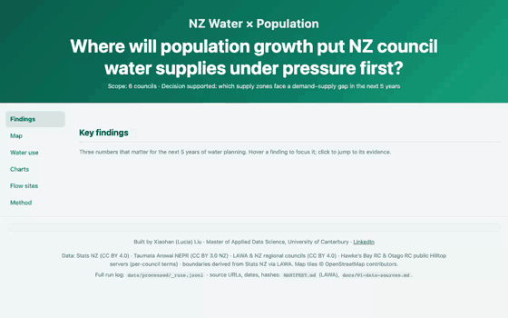

# NZ Water × Population

[](https://github.com/USER/REPO/actions)
[](#data-sources--licences)

**Where will population growth put NZ council water supplies under pressure first?**

[**Live site →**](https://USER.github.io/REPO/) · [The SQL →](sql/) · [Findings →](ANALYSIS.md)



> **Status: W2 — analysis + static site.** The pipeline is live and the
> numbers below are real (2026-08-30 run): Stats NZ population (6 regions) ×
> Taumata Arowai NEPR 2024/25 (all registered supplies) → findings 1–2 below
> are 6/6-region backed. Finding 3 is the data-availability finding.
> Section B (water quality vs land use) is outlined in [ANALYSIS.md](ANALYSIS.md).

---

## TL;DR — three findings

1. **2.3× per-capita gap.** Hawke's Bay supplies **610 L/person/day** vs
   Auckland **270** (NEPR 2024/25). Matching Auckland's efficiency in HB
   alone frees ≈ **48,800 m³/day — ~62% of the 6-region demand growth
   projected to 2030**.
   *So what:* efficiency and metering buy 1.5–2 years of growth headroom
   before new capacity is needed.
   

2. **22.5% of supply leaks.** **298,671 m³/day** is lost to leaks across the
   6 regions; Canterbury alone leaks **86,832 m³/day — 3.5× its own
   projected 2030 demand growth**. The leaked volume ≈ 1.1M people at
   Auckland's usage.
   *So what:* fixing leaks is a supply-side lever that doesn't wait for
   population — Canterbury's leaks already exceed a decade of its growth.

3. **2 of 6 councils publish open flow time series.** HBRC is live; ORC's
   public server froze at 2021-04-23 (current values are on ORC AQWebPortal /
   LAWA). Where we can look (3 live HB sites, 2026-08-30), flows sit at the
   **9.5th–40.5th** percentile — Ngaruroro at Fernhill is in the driest ~10%
   of its 5-year record.
   *So what:* source-water availability is only locally observable;
   demand-side planning must lean on 6/6 datasets like NEPR.

> Full write-up, method and caveats: [ANALYSIS.md](ANALYSIS.md)

## Who this is for

**Audience:** regional council asset planners and three-waters analysts.
**Decision it supports:** which supply zones are most likely to face a
demand–supply gap under projected population growth over the next 5 years.

Every chart on the site answers one sub-question of that decision.
Scope: **6 councils** — Auckland · Canterbury · Otago · Hawke's Bay ·
Southland · Waikato. Depth over national coverage, deliberately.
Flow coverage: only HBRC (live) and ORC (historical public record) publish
open flow time series; the other four councils' public endpoints expose
metadata only — see the flow caveats on the site and in ANALYSIS.md.

## How it works

```
Stats NZ ADE API ─┐
Water NZ NPR ─────┼─→ scripts/  ─→ DuckDB ─→ data/processed/*.json ─→ static site
Council Hilltop ──┤     (extract)   (sql/)     + schema + _runs.jsonl    (ECharts
LAWA snapshot ────┘                                                     + Leaflet)
```

- `data/processed/` is the **single source of truth** for the front end:
  versioned JSON + JSON Schema + a UTC timestamp per source.
- Refresh cadence matches each source's real cadence — see the table below.
  This is an **automated pipeline with freshness SLAs**, not a real-time feed.
- The site's **Data Health** panel reads `_runs.jsonl`: last successful run,
  row counts, null rates, schema version, last 20 runs.

## The SQL

All business logic lives in `sql/`; Python only does IO and orchestration (DuckDB).

| File | What it does |
|---|---|
| [`01_region_population_growth.sql`](sql/01_region_population_growth.sql) | YoY + 5-year CAGR per council (window functions) |
| [`02_supply_per_capita.sql`](sql/02_supply_per_capita.sql) | Population × NEPR 2024/25 (all registered supplies): litres/person/day, leakage, CARL, ILI, implied daily demand + 2030 projection |
| [`03_flow_percentile.sql`](sql/03_flow_percentile.sql) | Latest observed river flow vs same-week historical percentile, per monitored site (supporting layer: 11 curated sites, HBRC live + ORC historical) |

## Why I don't claim causation

- **Ecological fallacy** — council-level correlation says nothing about
  catchment-level mechanism.
- **n = 6** — no correlation across this few units is robust; one large
  council can flip the sign.
- **Confounding** — land use (dairy intensity, irrigation) drives NZ river
  water quality far more than urban population. Section B in
  [ANALYSIS.md](ANALYSIS.md) sets out the test for this claim (population
  signal vs land use, stratified) — analysis pending after W2.
- **Site selection bias** — LAWA monitoring sites are not randomly located.
- NEPR/NPR figures are council-reported; metering coverage varies.

## Data sources & licences

| Source | Used for | Cadence | Licence |
|---|---|---|---|
| [Stats NZ SDMX API](https://explore.data.stats.govt.nz/) | Subnational population estimates (2018–2025, 6 regions) | Annual (30 Jun) | CC BY 4.0 |
| [Taumata Arowai NEPR](https://www.taumataarowai.govt.nz/) | Water demand, leakage (CARL), metering per supplier (NPR successor) | Annual | CC BY 3.0 NZ |
| [Water New Zealand NPR 2021/22](https://www.waternz.org.nz/NationalPerformanceReview) | Demand / leakage / metering (final edition; dashboard data) | Ended 2021/22 | Water NZ terms (non-commercial with attribution) |
| [LAWA](https://www.lawa.org.nz/explore-data/water-quantity/) | Regional council boundaries (WKT via LAWA map service, derived from Stats NZ) | Static | CC BY 4.0 |
| HBRC Hilltop (`data.hbrc.govt.nz`) | River flow, realtime (3 sites) | 15 min | Per-council terms; public access |
| ORC Hilltop (`gisdata.orc.govt.nz`) | River flow, historical 2010–2021 (8 sites) | 5 min | Per-council terms; public access |
| [LAWA](https://www.lawa.org.nz/download-data) | River water quality state & trend | Annual snapshot, downloaded 2026-08-30 | CC BY 4.0 |

Contains data sourced from Stats NZ and licensed for reuse under **CC BY 4.0**.
Water quality data courtesy of **LAWA** and New Zealand's regional councils.
Boundary data via **LAWA** (CC BY 4.0; originally derived from Stats NZ regional
council boundaries). Water demand/network data courtesy of **Taumata Arowai**
(CC BY 3.0 NZ) and **Water New Zealand**. River flow data courtesy of
**Hawke's Bay Regional Council** and **Otago Regional Council** public Hilltop servers.

## Run it yourself

```bash
git clone https://github.com/USER/REPO && cd REPO
cp .env.example .env        # add your Stats NZ API key
make all                    # fetch → transform → validate → build site
make test                   # pytest: schema, units, region names, DST, nulls
python -m http.server -d site 8000
```

`data/raw/sample/` holds a trimmed fixture set so `make test` runs offline.

## Repo layout

```
scripts/    extract + orchestrate (Python)
sql/        all business logic (DuckDB)
schemas/    JSON Schema per processed dataset
site/       static front end (ECharts + Leaflet), no build step
tests/      pytest
data/
  raw/      source snapshots + sample fixtures
  processed/ single source of truth: *.json, *.schema.json, _runs.jsonl
```

## Status

Pipeline runs on GitHub Actions: flow every 6 h (ramping from 24 h during
bring-up), water quality and population monthly. If the badge above is red or
the site header says *pipeline paused*, the data shown is the last good
snapshot — the site degrades to stale rather than blank, by design.

---

Built by Xiaohan (Lucia) Liu · Master of Applied Data Science,
University of Canterbury · [LinkedIn](https://linkedin.com/in/xiaohan-liu-755017382)
